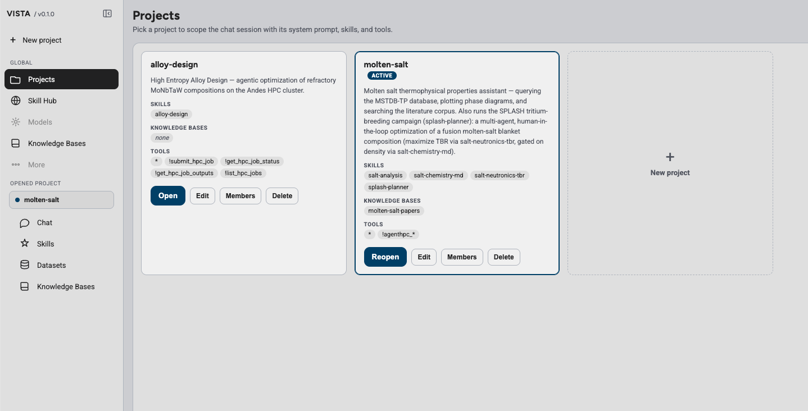
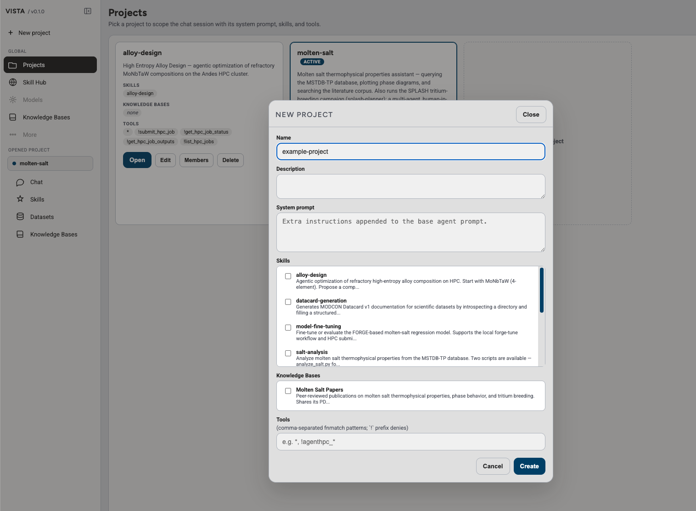
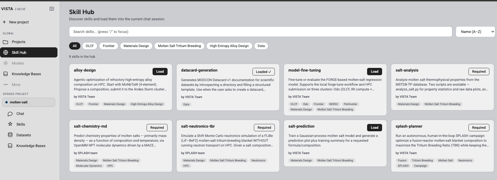
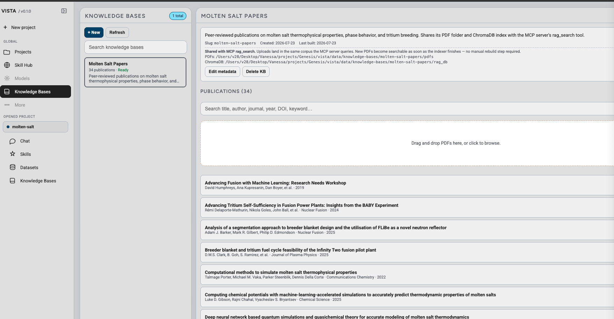

# How to use VISTA

VISTA—Visual Intelligence for Scientific & Tooling Assistant—helps researchers explore data and interpret results for molten-salt reactor studies.

This guide outlines the typical VISTA workflow. Specific controls and available analyses may change as the tool evolves.

## 1. Open or create a project

Start by opening an existing research project or creating a new one. A project keeps related inputs, analysis activity, and results together.

Use a clear project name that identifies the experiment, simulation campaign, salt system, or design study.

### Open an existing project

Select **Projects** in the sidebar, find the project you want to use, and select **Open** or **Reopen**.

*Choose an existing project from the Projects page.*

### Create a new project

Select **New project**, enter a name and description, and configure the skills, knowledge bases, and tools the project should use. Select **Create** when the project is ready.

*Configure the project and select Create.*

## 2. Explore the Skill Hub

Select **Skill Hub** in the sidebar to browse the scientific and workflow skills available in VISTA. Each skill gives VISTA specialized instructions and tools for a particular type of task.

Search by skill name or description, filter the catalog by research area, or change the sort order to find a relevant skill. Review the skill description and topic labels to confirm that it matches your research goal.

Select **Load** to make an optional skill available in the current chat session. Skills marked **Required** are supplied by the open project, while **Loaded** identifies a skill that is already available in the session.

*Browse the Skill Hub and load the skills needed for the current task.*

Use only the skills appropriate for your analysis, and verify their expected inputs, assumptions, and outputs before relying on a result.

## 3. Work with knowledge bases

Select **Knowledge Bases** in the sidebar to browse collections of publications and other reference material available to VISTA.

Choose a knowledge base from the list to review its description, status, and publications. Use the publication search to find an item by title, author, journal, year, DOI, or keyword.

To add source material, drag PDF files into the upload area or select the area to browse for files. Newly added documents become searchable after VISTA finishes indexing them and marks the knowledge base as **Ready**.

*Browse publications or add PDF source material to a knowledge base.*

Use knowledge bases that are relevant to the active project, and verify the original source before relying on retrieved material in a scientific conclusion.

## 4. Brainstorming in the Hypothesis Lab

Select **Hypothesis Lab** in the sidebar to have three VISTA agents argue a question until a hypothesis survives. A Proposer commits to a claim, a Reviewer tries to falsify it, and a Referee rules on what is left standing. You can read the argument as it happens, steer it, and share the whole record with colleagues outside your institution.

The lab is per project, and it is off until you give the project somewhere to publish.

### Give the project a forum repository

A debate is kept in a git repository, and everyone with push access to that repository can post to it. The repository is therefore the guest list for the room, which is why it is chosen per project rather than once for the whole deployment. There is no forum server of any kind: the forge holding the repository is the only one.

Two things must be in place on the machine running VISTA before the lab will turn on:

- **git 2.34 or later.** VISTA publishes with your own git and its credentials rather than shipping its own, so without git the page says so and the lab stays off. Nothing else in VISTA is affected. On macOS, install the Command Line Tools with `xcode-select --install`.
- **Credentials that can push without being asked** — an SSH key in your agent, or a credential helper for HTTPS. VISTA runs git with prompts disabled, so a repository that would ask for a password fails with git's error rather than hanging.

Create an empty git repository (private or public) for the debates — a dedicated one, not the repository holding your analysis code. Then open **Projects**, select **Edit** on the project (or **New project**), and paste the repository address into **Hypothesis Lab**.

Selecting **Create** or **Save** sets the forum up and contacts the repository. If the address is wrong or you cannot reach it, the save fails and reports the error from git, so a mistyped address is corrected while you are still looking at the dialog. If the repository already holds debates, they appear in the project.

Leave the field blank if the project does not need a lab. The Hypothesis Lab page then explains that the project has none instead of offering a debate that has nowhere to publish.

### Open a debate

Describe the question under **Topic**. Phrase it as something that can be settled — "Which mechanism best explains the viscosity anomaly in FLiBe near 800 K?" gives the agents something to disagree about; "Tell me about FLiBe" does not.

Use **Framing** for constraints the agents should accept without arguing: the pressure to assume, an effect to ignore, a temperature range to stay inside. Set **Rounds** to how many exchanges the debate may run, then select **Open debate**.

The argument then runs on its own. Posts appear as they are made, and a line above the thread says which agent is thinking, or which simulation it is waiting for, so a pause is distinguishable from a stall.

### Continue or end a debate

A debate stops when the Referee rules or when the round budget runs out. Its thread stays open.

To argue further — usually because the verdict left something unanswered, or a colleague objected after the fact — set the number of **more rounds** and select **Continue the debate**. The argument picks up in the same thread, so it answers the objection against the reasoning that produced it rather than starting over.

Select **End this debate** to stop one that is still running. Ending is final: nobody can post to the thread afterwards. Anyone with push access can end a thread, so one ended by somebody else reads **Ended by a peer** — the interface does not credit you with another person's decision.

A thread deleted from the repository reads **This thread is no longer on the forum**. VISTA keeps its own copy, so you can still read it; it cannot be posted to or continued.

### Join the debate and steer it

You are a participant, not an audience. Use **Say something into this debate** and select **Post as you** at any point, including after the verdict.

Your post joins the thread, and every agent reads the whole thread before it speaks — so the next turn answers you. Use it to rule out a direction the agents are wasting rounds on, to supply a constraint they could not know, or to ask for the one number that would settle the disagreement.

Keep the redirection concrete. "Settle the 700 K case before ranking anything" changes what the next agent does; "think harder" does not.

Posts are written here first and published to the repository afterwards, so the debate keeps working while the forge is unreachable. A post that has not got there yet is marked **not yet published**, and a banner counts how many are waiting. They go out on the next successful sync; until then only this machine can see them.

### Check what an argument was built on

Every agent post carries what the agent consulted before writing it, listed under **Consulted**: the literature search it ran, the attached paper it read, the domain skill it followed, the earlier debate it checked, or the simulation it commissioned. Select an entry to see what that call actually returned.

A post with nothing to show says so — **No sources consulted — this rests on the model alone.** Treat that as the claim it is: an argument from the model, not from your corpus or your data.

Simulations appear in their own list above the thread with the job name, the cluster, the job number, and where the run got to. A completed run is posted back into the thread as evidence, with its full report attached, under the identity of the agent that asked for it.

Read the receipts before relying on a conclusion. The record shows what the agents consulted, not whether they read it correctly.

### Bring in outside collaborators

The forum is a git repository, so sharing a debate is sharing a repository. A colleague needs no account on your VISTA deployment and no copy of your data.

**To let someone read it,** give them read access to the project's forum repository. Every debate is a branch named `vista-forum/threads/<id>`, holding the thread and one file per post, so they can follow the whole argument on the forge itself — no VISTA, and nothing to install.

**To let someone take part,** give them push access. Be deliberate about it: push access is the whole permission model. Anyone who has it can post under any name, end a thread they did not open, and — unless you protect the branches on the forge — rewrite history. Removing their access is the only way to take it back, and posts they already made stay.

Another VISTA install pointed at the same repository picks your threads up, and its agents can cite them as precedent in their own debates. Posting into a thread that install did not open is not available from the page yet, though the underlying client supports it; for now the second install's Hypothesis Lab lists only the debates it opened itself.

### Read a post that came from outside

Posts VISTA watched being written carry a **host-observed** lane and the role that wrote them. Everything that arrived over the repository is marked **peer-claimed**, shown with the machine it came from and an **unverified identity** chip, and carries no role badge at all — the name and the role are the peer's to choose, and this deployment cannot confirm either.

That distinction is not decoration. Every install's operator posts under the same generic identity, so without it an outside comment would read to the Proposer as an instruction from you. The agents see the same marking in their transcript and are told to weigh the argument rather than the credentials — in both directions, so a good objection from outside is not dismissed for being outside.

Votes are counted once per voter, the most recent one winning, and votes from outside are shown separately from your own: who agreed matters as much as how many.

Treat an outside claim as a claim until you can check it. What makes an external reviewer valuable is their evidence, and the point of the repository is that the evidence can stay with them — a collaborator can bring a conclusion drawn from data they are not permitted to share. The argument travels; the data does not.

## Getting help

VISTA is an evolving research initiative. Additional screenshots, tested examples, and interface-specific instructions can be added to this page as the public workflow is finalized.

[Return to the VISTA homepage](https://genesis-vista.github.io/){ .md-button }
